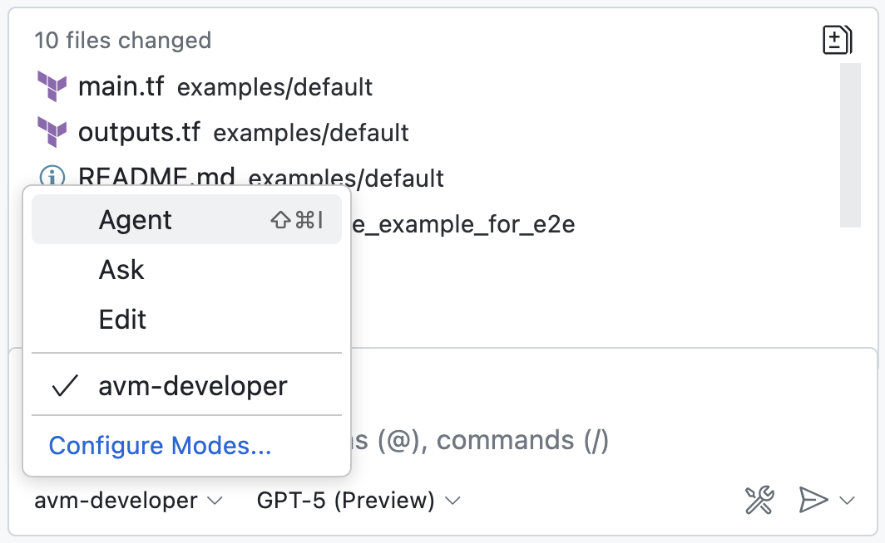

# gh-copilot-chatmodes
AI-driven development tools are reshaping how developers interact with code. GitHub Copilot Chat for Visual Studio Code supports customizable chat modes that can be tailored to specific workflows, improving accuracy and productivity. 

This repository contains custom `chatmode.md` files created as part of my daily workflow and customer engagements.

Please go through [Official Documentation](https://code.visualstudio.com/docs/copilot/chat/chat-modes) before getting started.

You may also find similar chatmodes from official github repo [here](https://github.com/github/awesome-copilot)

## 💠 Custom Chat Modes
Chat modes define how Copilot behaves during interactions. Whether you're debugging, generating boilerplate code, or exploring new APIs, chat modes let you configure Copilot’s responses to suit your task.

1. To use any of these chat modes, simply include the corresponding `chatmode.md` file in your project workspace's `.github/chatmodes` directory and configure your development environment to recognize it.
2. Restart VS Code to load the new chat mode.
3. Open the Copilot Chat panel to start interacting with the new chat mode.
4. Click the dropdown menu at the bottom of the chat panel and select your custom chat mode from the list.

| Title | Description |
| ----- | ----------- |
| [AVM Developer](chatmodes/avm-developer.chatmode.md) | Design, implement, test, and release Azure Verified Modules (AVM) in Terraform with autonomous planning & execution aligned to AVM standards. |